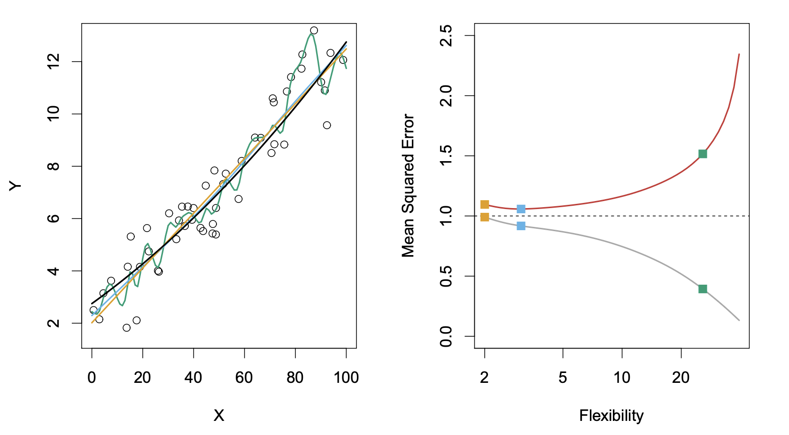
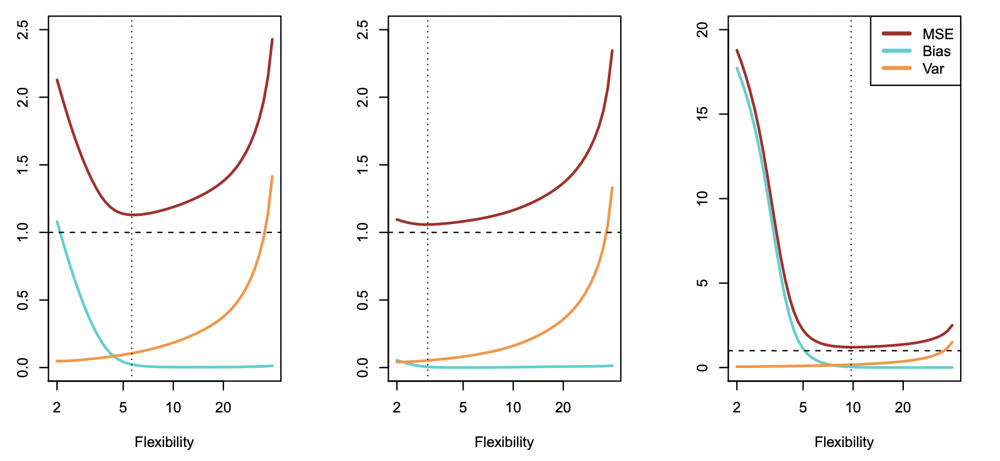

# Notation
$n$ denotes data points or the number of observations
$p$ denotes the number of variables available to make predictions; predictors or variables are often called features in statistical learning

In general $x_{ij}$ is used to denote $i^{th}$ observation of $j^{th}$ variable -> Therefore, $i$ is always used to index over samples or observations and $j$ is always used to index over variables.

Capital bold letters are used to illustrate matrices, for example: $\mathbf{X}$  denotes the following $n \times p$  matrix whose $(i,j)$ observation ($x_{ij}$) is our data point for $j^{th}$ variable
$$
\mathbf{X} = \begin{bmatrix}
x_{11} & x_{12} & \cdots & x_{1p} \\
x_{21} & x_{22} & \cdots & x_{2p} \\
\vdots & \vdots & \ddots & \vdots \\
x_{n1} & x_{n2} & \cdots & x_{np}
\end{bmatrix}
$$
data vectors for different variable (whose length is $n$) are denoted by lowercase bold letters $\mathbf{x}$, and are always column vectors like following 
$$\mathbf{x_j} = \begin{bmatrix}
x_{1j}\\
x_{2j}\\
\vdots\\
x_{nj}
\end{bmatrix}
$$
feature vectors whose length is equal to number of variables $p$ are denoted by lowercase normal letter $x$; see following example
$$x_i = \begin{bmatrix}
x_{i1}\\
x_{i2}\\
\vdots\\
x_{ip}
\end{bmatrix}
$$
The variable which is being used to make predictions is denoted by $y_i$ for $i^{th}$ observation. This can be represented in column vector notation similar to above

Scalar are denoted as $a \in \mathbb{R}$ 
vector as $\mathbf{a} \in \mathbb{R}^n$ for a vector of length $n$
matrices as $\mathbf{X} \in \mathbb{R}^{n \times d}$ for $n \times d$ matrix

One important matrix operation is used which is product of two matrices denoted by $\mathbf{AB}$ and 
each $(i,j)th$  element in resulting matrix is computed by multiplying each element of $ith$ row of $\mathbf{A}$ with corresponding element of $jth$ column in $\mathbf{B}$; see example below

$$
\mathbf{AB} = \begin{bmatrix}
1 & 2 \\
3 & 4
\end{bmatrix}
\begin{bmatrix}
5 & 6 \\
7 & 8
\end{bmatrix}
=
\begin{bmatrix}
1 \times 5 + 2 \times 7 && 1 \times 6 + 2 \times 8 \\
3 \times 5 + 4 \times 7 && 3 \times 6 + 4 \times 8
\end{bmatrix}
$$

--- 
# What is statistical learning
To illustrate the definition consider following example:

Suppose we observed a quantitative dependent variable $y_i$ (belonging to vector $\mathbf{y}$) and $p$ predictors $\mathbf{x_1,x_2} \cdots \mathbf{x_p}$ (predictors can also be written as $\mathbf{X} = \mathbf{[x_1,x_2,}$ $\cdots, \mathbf{x_p]}$ )

Assume that there is a function $f$ such that
$$\mathbf{y} = f(\mathbf{X}) + \epsilon$$ where $\epsilon$ is an random error drawn from normal distribution with mean $0$
then statistical learning can be defined as learning function $f$ such that we can make predictions and inferences with it.

## Predictions
Statistical learning procedures often learn $\hat{f}$ which are our estimate of $f$. The learnt function can help us predict our response variable:
$$\hat{y} = \hat{f}(\mathbf{X})$$ where $\hat{y}$ is our estimated data. One thing to note is that our estimate will always have reducible and irreducible error. Reducible error can be decreased by using a more appropriate learning procedure but irreducible error ($\epsilon$) cannot be decreased since it results from unmeasured (predictors that were not considered) or unmeasurable variation.
$$
\begin{align}
E[(y-\hat{y})^{2}] = E[(f(\mathbf{X})+ \epsilon)- (\hat{f}(\mathbf{X}))^2] \\
= (f(\mathbf{X}) - \hat{f}(\mathbf{X}))^2 + var(\epsilon)
\end{align}

$$
where $(f(\mathbf{X}) - \hat{f}(\mathbf{X}))^2$ is reducible error and $var(\epsilon)$ is irreducible error
irreducible error provides upper bound on accuracy of our prediction, however that upper bound is not always known 
## Inference

Learned functions can also be used to make inferences. But contrary to prediction case where $\hat{f}$ can be treated as a blackbox (i.e., we do not have to know $\hat{f}$ form and structure), in inference case  $\hat{f}$ has to be known

the inference problems can be categorized as follows:
1) Finding association between response variable and each predictor
2) Finding which predictors has the most weight is explaining our response variable or which predictors are associated at all.
3) Is the relationship linear or non-inear.

## How to estimate $\hat{f}$ ?
There are number of different statistical learning methods and procedures but generally the process looks like follows.
We take training data: $[x_i, y_i]$ where $x_i = [x_{i1},x_{i2}, \cdots ,x_{ip}]$ and $y_i$ are individual response variables or $\mathbf{y} = [y_1,y_2...y_n]$. Generally applying non-parametric or parametric training procedures on training data to learn $\hat{f}$

1) **Parametric approach:** In this approach we assume a functional form $f$ and this assumption simplifies the estimation to estimating $p+1$ coefficients. For example, assuming linear functional form we get linear regression
2) **Non-parametric approach:** Here we do not assume any functional form. Examples include thin-spine plate. Cons of this approach are that they are computationally more complex, require more observations to accurately estimate the function and are more amenable to overfitting. 
## Trade-off between prediction accuracy and model interpretability

Generally models that are highly flexible approaches are less interpretability for example:
1) Support vector machines, neural nets are highly flexible but less interpretable
2) lasso method and linear regressions are less flexible but more interpretable
More flexible approach will also generally yield models that have better prediction accuracy if model is not overfitted

## Supervised and unsupervised learning

1) **Supervised learning:** When for each $ith$ observation of predictor measurement there is an associated value $y_i$ in response variable vector ($\mathbf{y} = [y_1,y_2,\cdots,y_n]$) and our goal is to fit a model to make predictions or inferences. We can utilize supervised learning methods. Examples include, logistic regressions, generalized additive models
2) **Unsupervised learning:** When associated response variable measurement for predictor measurements is not known and we wish to know relationship between observations or predictors, we can utilize unsupervised learning. Examples include clustering analysis

# Assessing model accuracy
How to choose which models are the best models to choose. We can measure the quality of a fit using MSE (*mean squared error*)

## Test and Training MSE of regression models
In regression setting, MSE is the most commonly used metric of model accuracy, it is given by the following equation:

$$
MSE = \frac{1}{n}\sum^{n}_{i=1}(y_i-\hat{f}(x_i))
$$
where $\hat{f}$ is our prediction function iterating over all observations in our training dataset.

Above given equation, given that it is iterating over training dataset, is called training MSE. However, this is not of much interest to us. Test MSE, which iterates over previously unseen observations is more informative and it is given by a similar equation:
$$Ave(y_o-\hat{f}(x_o))$$ where $(x_o,y_o)$ are previously unseen observations not present in the training dataset. 

Training MSE and test MSE have a very complex relationship depending on the $f$. And it is generally not true that $\hat{f}$ with lowest training MSE will also have lowest test MSE. 

Following figure from ISLP textbook illustrates this using an analysis on simulated dataset where different statistical learning methods ranging in flexibility were used. True data simulated with $f$ is in black, linear fit (least flexible) in orange, two smoothing spline fits in blue and green curves. Right panel shows Training MSE (grey curve), test MSE (red
curve), and minimum possible test MSE over all methods (dashed line)

*Figure 1.1*

The relationship between test MSE and training MSE is dependent on the nature of underlying $f$. One shared pattern however is that as flexibility of statistical learning method increases training MSE decreases, test MSE may or may not. One thing to note is that training MSE will always be smaller than test MSE because almost all statistical learning methods are designed to minimize training MSE.

### Bias-Variance Trade-Off
The U-shaped curve for test MSE we saw in the previous section is a result of two competing properties that arise when we write the mathematical expression for the expectation of test MSE:
$$E[(y_o-\hat{f}(x_o))^{2}] = Var(\hat{f}(x_o)) + [bias(\hat{f}(x_o))]^2 + Var(\epsilon) $$

This equation tells us that to minimize the expected test MSE, we need to simultaneously minimize variance of $\hat{f}$ and squared bias of $\hat{f}$.
Variance of $\hat{f}$ is computed by deriving estimates produced from the same test data set but different training datasets.
Bias refers to $E[\hat{f}(x_o)] - f(x_o)$. So basically, how much is the average prediction value different from true function output.

*Figure 1.2: Bias-variance trade-off across three simulated datasets. Left panel: non-linear $f$; middle panel: linear $f$; right panel: highly non-linear $f$.*

## Analogue to classification models
The MSE analogous for classification models is training and test error rates which count the number of mistakes (misclassified observations by $\hat{f}$) in our sample space which can be either training data or test data. Following equations denote the mathematical expression for these error rates

**Training error rate**
$$
\frac{1}{n}\sum^n_{i=1}I(y_i\neq \hat{y}_i)
$$
where $I(y_i \neq \hat{y}_i)$ is the identity function which is 1 when the inequality is met and 0 otherwise. 

Similarly, **Test error rate** is

$$Ave(I(y_i \neq \hat{y}_i))$$

### Bayes Classifier
It can be formally proved that the test error rate is minimized by a classifier which assigns the most likely class conditioned on the predictor variables. Or in other words the bayes classifier which assigns each test observation with predictor vector $x_o$ to class $j$ for which following conditional probability is maximum. 

$$Pr(Y=j | X =x _o)$$
Since bayes classifier will always choose the class label for which above probability is maximum the maximum error rate is $1-{max}_jPr(Y=j|X=x_o)$ where ${max}_j$ denotes the class which was picked due to max probability. Following this Bayes error rate is:

$$1-E[({max}_jPr(Y=j | X = x_o))]$$
This error rate is analogous to irreducible error and bayes classifier is an ideal classifier which is never possible with real data since we would not know the conditional probabilities of class labels conditioned over predictor variable vector.
### K- nearest neighbors classifier
Generally, different classification approaches try to estimate conditional distribution of $Y$ given $X$ and use this distribution to classify a given test observation to class with highest estimated probability. One such approach is K-nearest neighbors (KNN); which picks $K$  points in training dataset which are closest to test observation $x_o$, this set is represented by $\mathcal{N}_o$ . Then conditional probability for class $j$ is estimated as fraction of values is $\mathcal{N}_o$ whose response values is equal to $j$:
$$
Pr(Y=j | X=x_o) = \frac{1}{K}\sum_{i\in \mathcal{N}_o}I(y_i=j)
$$
KNN can be pretty good estimator of bayes classifier however it also has a flexibility parameter which is function of $\frac{1}{K}$. At lower values of $K$ we get highly flexible decision boundary, this corresponds to low bias and high variance. At higher values of $K$ we get inflexible decision boundary however this corresponds to a classifier with high bias but low variance.

The U-shaped test error rate curve in response to increasing flexibility also exists in classification problems so these are also subject to bias-variance trade-off. 
